# Storage-Sage System Architecture

Production engineering documentation for the Storage-Sage distributed cleanup system.

## Table of Contents
1. [System Context Diagram](#1-system-context-diagram)
2. [Internal Component Architecture](#2-internal-component-architecture)
3. [Data Flow Diagram](#3-data-flow-diagram)
4. [Observability Architecture](#4-observability-architecture)
5. [Execution Pipeline Detail](#5-execution-pipeline-detail)
6. [Legend](#6-legend)

---

## 1. System Context Diagram

High-level view showing all system boundaries, actors, and external integrations.

---

## 2. Internal Component Architecture

Detailed view of Storage-Sage internal subsystems and their relationships.

```mermaid
flowchart TB
    subgraph ENTRY["Entry Points"]
        CLI["CLI Parser<br/>cmd/storage-sage/main.go"]
        HTTP_TRIGGER["HTTP /trigger"]
        SCHEDULER["Interval Scheduler<br/>time.Ticker"]
    end

    subgraph DAEMON_LAYER["Daemon Layer"]
        DAEMON_CTRL["Daemon Controller<br/>internal/daemon/daemon.go"]
        STATE_MACHINE["State Machine<br/>Starting→Ready→Running→Stopping"]
        HTTP_SERVER["HTTP Server<br/>health, ready, status, API"]
        SIGNAL_HANDLER["Signal Handler<br/>SIGINT, SIGTERM"]
    end

    subgraph ORCHESTRATION["Orchestration Layer"]
        RUN_CORE["runCore()<br/>Pipeline Orchestrator"]
        CONFIG["Config Loader<br/>internal/config/"]
        ENV_SNAPSHOT["Environment Snapshot<br/>disk usage, time"]
    end

    subgraph PIPELINE["Core Pipeline"]
        direction LR
        SCANNER["Scanner<br/>internal/scanner/"]
        PLANNER["Planner<br/>internal/planner/"]
        EXECUTOR["Executor<br/>internal/executor/"]
    end

    subgraph POLICY_ENGINE["Policy Engine"]
        AGE_POLICY["AgePolicy<br/>min_age_days"]
        SIZE_POLICY["SizePolicy<br/>min_size_mb"]
        EXT_POLICY["ExtensionPolicy<br/>.tmp, .log"]
        EXCL_POLICY["ExclusionPolicy<br/>glob patterns"]
        COMPOSITE["CompositePolicy<br/>AND/OR logic"]
    end

    subgraph SAFETY_ENGINE["Safety Engine"]
        TYPE_GATE["Type Gate<br/>dir delete permission"]
        PROTECTED["Protected Paths<br/>/etc, /usr, /boot"]
        ALLOWED_ROOTS["Allowed Roots<br/>containment check"]
        ANCESTOR_SYM["Ancestor Symlink<br/>escape detection"]
        SYMLINK_ESC["Symlink Escape<br/>target validation"]
    end

    subgraph SUPPORT["Support Systems"]
        METRICS["Metrics Collector<br/>internal/metrics/"]
        LOGGER["Structured Logger<br/>internal/logger/"]
        LOKI_SHIP["Loki Shipper<br/>async batch"]
        AUDITOR["Auditor<br/>internal/auditor/"]
        NOTIFIER["Notifier<br/>webhooks"]
    end

    subgraph OUTPUTS["Output Sinks"]
        STDOUT["stdout/stderr"]
        AUDIT_FILE[("Audit Files")]
        METRICS_HTTP["/metrics HTTP"]
        LOKI_API["Loki Push API"]
        WEBHOOK_EP["Webhook Endpoints"]
    end

    %% Entry flows
    CLI --> DAEMON_CTRL
    CLI -->|"one-shot"| RUN_CORE
    HTTP_TRIGGER --> DAEMON_CTRL
    SCHEDULER --> DAEMON_CTRL

    %% Daemon layer
    DAEMON_CTRL --> STATE_MACHINE
    DAEMON_CTRL --> HTTP_SERVER
    DAEMON_CTRL --> SIGNAL_HANDLER
    DAEMON_CTRL -->|"runFunc"| RUN_CORE

    %% Orchestration
    RUN_CORE --> CONFIG
    RUN_CORE --> ENV_SNAPSHOT
    RUN_CORE --> SCANNER
    CONFIG --> COMPOSITE
    CONFIG --> SAFETY_ENGINE

    %% Pipeline flow
    SCANNER -->|"chan Candidate"| PLANNER
    PLANNER -->|"[]PlanItem"| EXECUTOR

    %% Policy composition
    AGE_POLICY --> COMPOSITE
    SIZE_POLICY --> COMPOSITE
    EXT_POLICY --> COMPOSITE
    EXCL_POLICY --> COMPOSITE
    COMPOSITE -->|"Evaluate()"| PLANNER

    %% Safety validation
    TYPE_GATE --> PLANNER
    PROTECTED --> PLANNER
    ALLOWED_ROOTS --> PLANNER
    ANCESTOR_SYM --> PLANNER
    SYMLINK_ESC --> PLANNER
    SAFETY_ENGINE -->|"Re-validate"| EXECUTOR

    %% Support system connections
    SCANNER --> METRICS
    PLANNER --> METRICS
    EXECUTOR --> METRICS
    PLANNER --> AUDITOR
    EXECUTOR --> AUDITOR
    RUN_CORE --> LOGGER
    LOGGER --> LOKI_SHIP
    EXECUTOR --> NOTIFIER

    %% Output flows
    LOGGER --> STDOUT
    AUDITOR --> AUDIT_FILE
    METRICS --> METRICS_HTTP
    LOKI_SHIP --> LOKI_API
    NOTIFIER --> WEBHOOK_EP

    %% Styling
    classDef entry fill:#e3f2fd,stroke:#1565c0
    classDef daemon fill:#fff3e0,stroke:#ef6c00
    classDef orch fill:#e8f5e9,stroke:#2e7d32
    classDef pipeline fill:#f3e5f5,stroke:#7b1fa2
    classDef policy fill:#fce4ec,stroke:#c2185b
    classDef safety fill:#ffebee,stroke:#c62828
    classDef support fill:#e0f2f1,stroke:#00695c
    classDef output fill:#eceff1,stroke:#37474f

    class CLI,HTTP_TRIGGER,SCHEDULER entry
    class DAEMON_CTRL,STATE_MACHINE,HTTP_SERVER,SIGNAL_HANDLER daemon
    class RUN_CORE,CONFIG,ENV_SNAPSHOT orch
    class SCANNER,PLANNER,EXECUTOR pipeline
    class AGE_POLICY,SIZE_POLICY,EXT_POLICY,EXCL_POLICY,COMPOSITE policy
    class TYPE_GATE,PROTECTED,ALLOWED_ROOTS,ANCESTOR_SYM,SYMLINK_ESC safety
    class METRICS,LOGGER,LOKI_SHIP,AUDITOR,NOTIFIER support
    class STDOUT,AUDIT_FILE,METRICS_HTTP,LOKI_API,WEBHOOK_EP output
```

---

## 3. Data Flow Diagram

Shows data transformation through the system with explicit types.

---

## 4. Observability Architecture

Complete observability stack with all data paths.

---

## 5. Execution Pipeline Detail

Detailed view of the 5-gate execution model with TOCTOU protection.

---

## 6. Legend

### Block Types

| Symbol | Type | Description |
|--------|------|-------------|
| Rectangle | **Action System** | Component that performs operations (Scanner, Executor) |
| Diamond | **Decision Point** | Conditional branching logic |
| Cylinder | **Data Store** | Persistent storage (SQLite, TSDB, Filesystem) |
| Rounded Rectangle | **Service** | Long-running process (Daemon, Prometheus, Grafana) |
| Parallelogram | **Data Object** | In-flight data structure (Candidate, PlanItem) |

### Arrow Types

| Arrow | Type | Description |
|-------|------|-------------|
| `-->` | **Control Flow** | Execution sequence or function call |
| `-->\|label\|` | **Data Flow** | Data transformation with type annotation |
| `-.->` | **Async/Batch** | Asynchronous or batched operation |
| `==>` | **Aggregation** | Multiple sources to single sink |

### Color Coding

| Color | Layer | Examples |
|-------|-------|----------|
| Blue (#e3f2fd) | **Input/Entry** | CLI, HTTP triggers, filesystem |
| Green (#e8f5e9) | **Processing** | Scanner, Planner, Executor |
| Orange (#fff3e0) | **Control** | Daemon, Scheduler, State Machine |
| Purple (#f3e5f5) | **Observability** | Metrics, Grafana, Dashboards |
| Red (#ffebee) | **Safety/Deny** | Safety engine, error paths |
| Yellow (#fff8e1) | **Decision** | Policy evaluation, gate checks |
| Grey (#eceff1) | **Output** | Audit logs, stdout, webhooks |

### Data Flow Paths

| Path | Protocol | Direction | Frequency |
|------|----------|-----------|-----------|
| Metrics Scrape | HTTP GET `/metrics` | Prometheus → Storage-Sage | Every 10s |
| Log Push | HTTP POST `/loki/api/v1/push` | Storage-Sage → Loki | Batch every 5s or 100 entries |
| Dashboard Query | HTTP PromQL/LogQL | Grafana → Prometheus/Loki | On refresh (30s default) |
| Webhook Notify | HTTP POST | Storage-Sage → External | On cleanup events |
| Audit Write | SQLite/File I/O | Storage-Sage → Disk | Per plan item + execution |

### System Roles

| Role | Components | Purpose |
|------|------------|---------|
| **Action** | Scanner, Executor, os.Remove | Perform filesystem operations |
| **Sensing** | Metrics Collector, Auditor | Capture system state and events |
| **Cognition** | Policy Engine, Safety Engine, Planner | Decision-making and planning |
| **Visualization** | Grafana, Web UI | Human-readable presentation |
| **Feedback** | Alertmanager, Webhooks | Closed-loop notification |

---

## Appendix: Network Ports

| Service | Port | Protocol | Purpose |
|---------|------|----------|---------|
| Storage-Sage Daemon | 8080 | HTTP | Web UI + REST API |
| Storage-Sage Metrics | 9090 (internal), 9091 (external) | HTTP | Prometheus metrics |
| Prometheus | 9090 | HTTP | Metrics storage + query |
| Loki | 3100 | HTTP | Log ingestion + query |
| Grafana | 3000 | HTTP | Visualization |

---

## Appendix: Metric Reference

### Counters (monotonically increasing)
- `storagesage_scanner_files_scanned_total{root}`
- `storagesage_scanner_dirs_scanned_total{root}`
- `storagesage_planner_policy_decisions_total{reason,allowed}`
- `storagesage_planner_safety_verdicts_total{reason,allowed}`
- `storagesage_executor_files_deleted_total{root}`
- `storagesage_executor_dirs_deleted_total{root}`
- `storagesage_executor_bytes_freed_total`
- `storagesage_executor_delete_errors_total{reason}`

### Gauges (point-in-time values)
- `storagesage_planner_bytes_eligible`
- `storagesage_planner_files_eligible`
- `storagesage_system_disk_usage_percent`
- `storagesage_system_cpu_usage_percent`

### Histograms (distributions)
- `storagesage_scanner_scan_duration_seconds{root}` (buckets: 0.1s to 100s)
